# 🌉 CrystalBridge: Integración Web-Minecraft

> **Arquitectura propietaria de comunicación bidireccional entre JavaScript (Web) y Java (Minecraft).**

**CrystalBridge** es el corazón comunicativo de CrystalTides, permitiendo que las acciones realizadas en el panel web se reflejen en el juego de forma segura y casi instantánea.

---

## 🛡️ ¿Por qué no usamos RCON?

El protocolo RCON estándar de Minecraft tiene limitaciones críticas:

1.  **Seguridad**: Requiere abrir puertos adicionales, exponiendo el servidor a ataques de fuerza bruta.
2.  **Disponibilidad**: Si el servidor está offline en el momento del comando, la instrucción se pierde.
3.  **Latencia**: No ofrece una confirmación asíncrona robusta.

**CrystalBridge** soluciona esto mediante el patrón **"Inbox" (Cola de Comandos)** con respaldo persistente.

---

## ⚙️ Arquitectura Híbrida v2.0

CrystalBridge utiliza un patrón **Event-Driven + Polling** para combinar la baja latencia de WebSockets con la fiabilidad de las bases de Datos.

### Diagrama de Flujo

```mermaid
sequenceDiagram
    participant Web as 🌐 Web Server (Node)
    participant DB as 🗄️ MySQL (Queue)
    participant MC as 🎮 Minecraft (Plugin)

    Note over Web,MC: Conexión WebSocket Establecida (Puerto 3001)

    par Flujo de Comando
        Web->>DB: 1. INSERT INTO pending_commands
        Web->>MC: 2. WS Event: "REFRESH_COMMANDS"
    end

    rect rgb(30, 30, 40)
        Note right of MC: ⚡ Reacción Inmediata (<50ms)
        MC->>DB: 3. SELECT WHERE executed = 0
        DB-->>MC: [Listado Comandos]

        loop Por cada comando
            MC->>MC: 4. Ejecutar (Bukkit Dispatch)
            MC->>DB: 5. UPDATE executed = 1
        end
    end

    opt Fallo de Red / Reinicio
        Note over MC: 🔄 Mecanismo de Respaldo
        MC->>MC: Polling cada 10s (Backup)
    end
```

### Componentes del Sistema

1.  **Web Server (Hub WebSocket)**: Actúa como el centro de despacho. Almacena el comando y emite una señal inmediata de refresco.
2.  **CrystalCore Plugin (Cliente WebSocket)**: Mantiene una conexión persistente. Al recibir la señal, procesa la cola de forma prioritaria.
3.  **MySQL (Source of Truth)**: Garantiza que ningún comando se pierda, sirviendo como auditoría y cola persistente.

---

## 🚀 Ventajas del Ecosistema

- **Latencia Cero**: Experiencia en tiempo real para el usuario final (ej: el item aparece tras comprarlo).
- **Inbound Security**: El servidor de Minecraft realiza una conexión _saliente_, eliminando la necesidad de abrir puertos de entrada peligrosos.
- **Tolerancia a Fallos**: Si el socket se desconecta, el sistema continúa operando via Polling hasta restaurar el enlace directo.

---

_Documentación actualizada: 12 de Enero de 2026_
