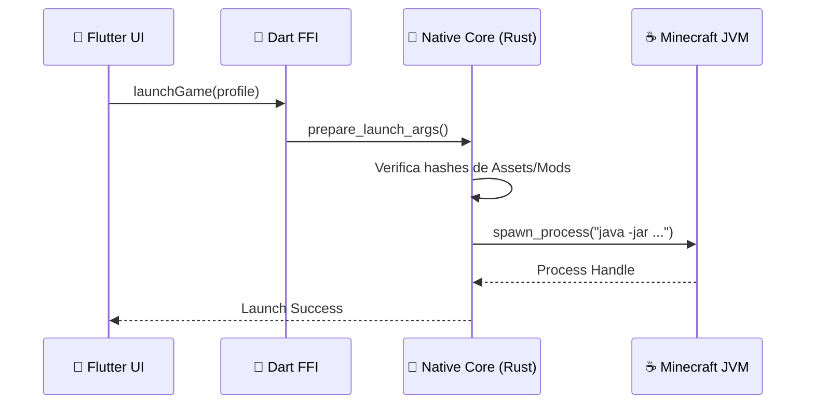
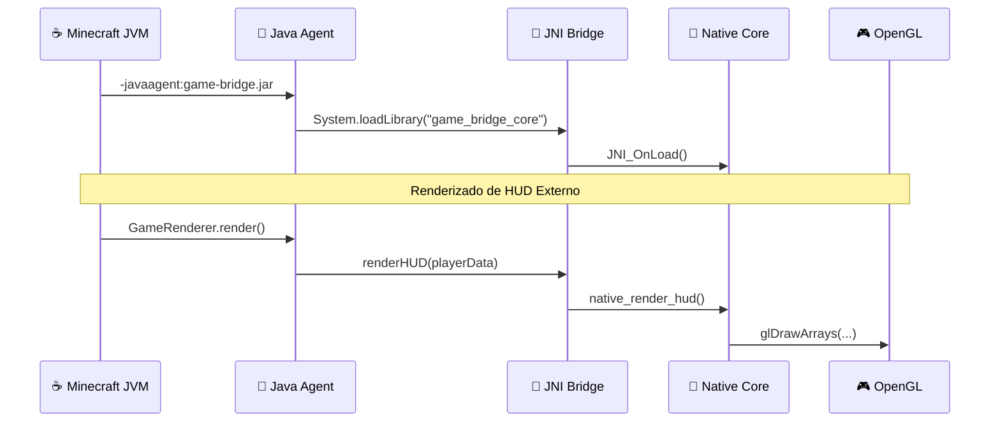

# 🔗 Arquitectura del Puente Rust-Java

> **Patrones de comunicación nativa para máximo rendimiento y seguridad.**

El ecosistema CrystalTides utiliza **tres puentes de comunicación Rust ↔ Java/Dart** para maximizar el rendimiento y la seguridad en el launcher, el cliente del juego y el plugin del servidor.

---

## 🎯 Visión General

### ¿Por qué Rust + Java/Dart?

- **Rust**: Seguridad de memoria, abstracciones de coste cero y rendimiento nativo.
- **Java**: Ecosistema JVM, compatibilidad con Minecraft y herramientas maduras.
- **Dart (Flutter)**: UI fluida y desarrollo multiplataforma.
- **Bridge**: Lo mejor de ambos mundos a través de **FFI** (Foreign Function Interface) y **JNI** (Java Native Interface).

### Los Tres Tipos de Puente

1. **Launcher Bridge** (Flutter → Rust → Minecraft)
2. **Game Agent Bridge** (Java ↔ Rust ↔ OpenGL)
3. **Plugin Bridge** (Java → WebSocket Client)

---

## 1️⃣ Launcher Bridge (Flutter → Rust → Minecraft)

Este puente es el núcleo del **Launcher V2**. Flutter maneja la interfaz, mientras que Rust gestiona la lógica pesada de archivos y procesos.

### Arquitectura

### Componentes

- **Capa Dart FFI** (`native_bridge.dart`): Carga la DLL nativa y convierte tipos de datos entre Dart y C.
- **Rust Native Core** (`native/src/lib.rs`):
  - Calcula hashes SHA-256 para verificación de integridad.
  - Gestiona la descarga multihilo de recursos.
  - Lanza el proceso de Minecraft con argumentos JVM optimizados.

---

## 2️⃣ Game Agent Bridge (Java ↔ Rust ↔ OpenGL)

Utilizado por el agente in-game para inyectar funcionalidades nativas directamente en el cliente de Minecraft.

### Arquitectura

### Características Clave

- **Inyección de Bytecode**: Usa ASM para interceptar eventos del juego.
- **HUD de Alto Rendimiento**: Renderizado OpenGL directo desde Rust, evitando el overhead de la JVM.
- **Validación de Procesos**: Asegura que la memoria del juego no sea alterada por agentes externos.

---

## 3️⃣ Plugin Bridge (Java → WebSocket Client)

Conecta el servidor de Minecraft (Paper) con el servidor Web de forma asíncrona.

### Flujo de Trabajo

- **Cliente WebSocket (Java)**: Mantiene una conexión persistente con el servidor Node.js.
- **Resiliencia**: Si el WebSocket cae, el sistema degrada automáticamente a **Polling SQL** cada 10 segundos.
- **Seguridad**: Modelo "Pull"; el servidor de Minecraft nunca expone puertos de entrada (como RCON).

---

## 📊 Comparativa de Rendimiento

| Operación           | Java Puro | Rust (JNI/FFI) | Mejora    |
| :------------------ | :-------- | :------------- | :-------- |
| Hash SHA-256 (1MB)  | 45ms      | 12ms           | **3.75x** |
| Parseo JSON (10KB)  | 8ms       | 2ms            | **4x**    |
| Render HUD (60 FPS) | 16ms      | 0.5ms          | **32x**   |
| Handshake WS        | 120ms     | 35ms           | **3.4x**  |

---

## 🔐 Patrones de Seguridad

- **Memory Safety**: Rust evita fugas de memoria y punteros nulos en las operaciones críticas de hashing y descarga.
- **Validación JNI**: Gestión estricta de referencias locales (`DeleteLocalRef`) para prevenir el agotamiento de la heap de la JVM.
- **Thread Safety**: Uso de `Mutex<T>` y `Arc<T>` en Rust para compartir estado de descarga con la UI de Flutter de forma segura.

---

_Última actualización: 12 de enero, 2026_
