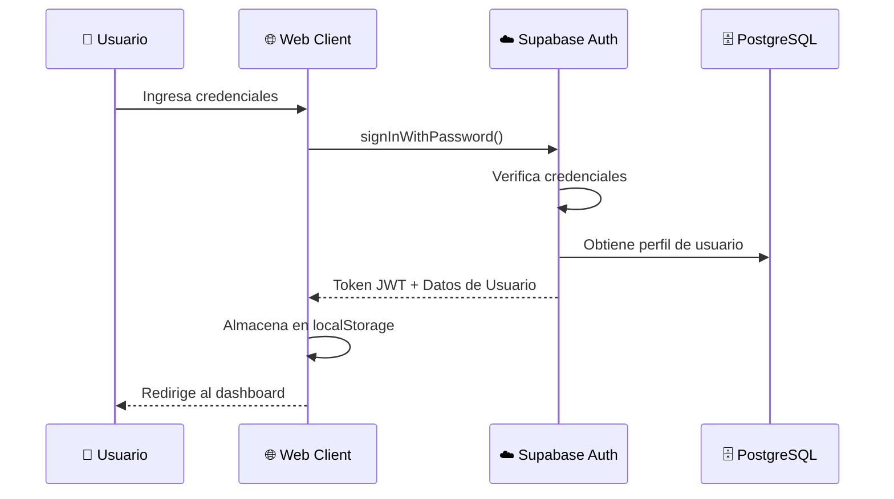
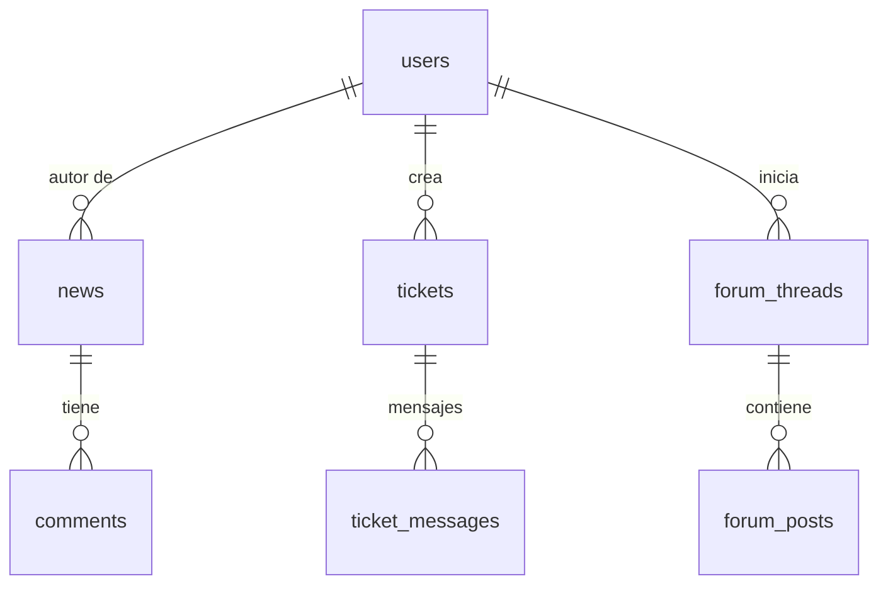

# ☁️ Integración con Supabase

> **Backend-as-a-Service (BaaS) que impulsa la plataforma web de CrystalTides.**

Supabase proporciona autenticación, base de datos (PostgreSQL), almacenamiento de archivos y capacidades en tiempo real para el ecosistema web de CrystalTides.

---

## 🎯 Visión General

### ¿Qué es Supabase?

Supabase es una alternativa de código abierto a Firebase construida sobre PostgreSQL. Proporciona:

- **Autenticación**: Email/contraseña y OAuth (Discord integrado).
- **Base de Datos**: PostgreSQL con Seguridad a Nivel de Fila (RLS).
- **Almacenamiento**: Almacenamiento de archivos con CDN.
- **Realtime**: Suscripciones vía WebSocket para datos en vivo.
- **Edge Functions**: Funciones serverless (Deno).

### Detalles del Proyecto

- **URL**: `https://gyoqnqvqhuxlcbrvtfia.supabase.co`
- **Estado**: Activo
- **Plan**: Free Tier (500MB DB / 1GB Storage)

---

## 🔐 Autenticación

### Proveedores

1. **Email/Contraseña**: Método de registro principal.
2. **Discord OAuth**: Login social prioritario para la comunidad de Minecraft.
3. **Microsoft OAuth**: Planeado para sincronización de cuentas oficiales.

### Flujo de Autenticación



---

## 🗄️ Base de Datos (PostgreSQL)

### Esquema Simplificado



### Tablas Críticas

#### `users` (Extendida de auth.users)

Almacena la relación entre la identidad web y la identidad in-game.

- `minecraft_uuid`: UUID único del jugador en Minecraft.
- `discord_id`: ID de Discord para sincronización de roles.
- `role`: (`user`, `staff`, `admin`).

#### `news` y `wiki`

Gestionadas a través de **TanStack Query** en el frontend para una carga ultrarrápida.

### Seguridad a Nivel de Fila (RLS)

Todas nuestras tablas tienen RLS habilitado.

- **Usuarios**: Solo pueden ver y editar su propio perfil.
- **Staff**: Permisos de lectura/escritura en noticias y tickets.
- **Público**: Solo lectura en noticias publicadas.

---

## 📦 Almacenamiento (Storage)

### Buckets Actuales

1. **`avatars`**: Fotos de perfil de usuario.
2. **`skins`**: Almacenamiento de archivos `.png` de skins de Minecraft (64x64).
3. **`news-media`**: Imágenes para artículos del blog.

---

## ⚡ Capacidades Realtime

Utilizamos el canal de Realtime de Supabase para:

- **Notificaciones de Tickets**: Los miembros del staff reciben alertas instantáneas cuando se crea un ticket.
- **Dashboard Overview**: Estadísticas vitales que se actualizan sin refrescar la página.
- **Chat Sync**: Sincronización básica de comentarios y mensajes.

---

## 🔗 Sincronización con MySQL (Global Link)

Dado que el servidor de Minecraft usa MySQL para datos masivos (LuckPerms, CoreProtect), usamos el **API Server (Node.js)** como puente:

1. El usuario solicita un código de vinculación en la Web.
2. El API Server genera un código en MySQL.
3. El usuario usa `/link <code>` in-game.
4. Un webhook activa la actualización del `minecraft_uuid` en la tabla `users` de Supabase.

---

## 🛡️ Seguridad y Variables de Entorno

### Configuración de Frontend (.env)

```env
VITE_SUPABASE_URL=https://gyoqnqvqhuxlcbrvtfia.supabase.co
VITE_SUPABASE_ANON_KEY=eyJhbG... (Public Key)
```

### Configuración de Backend

Utilizamos la `SERVICE_ROLE_KEY` (privada) únicamente en el servidor Node.js para realizar operaciones administrativas que requieren saltar el RLS (ej: vinculación forzada de cuentas).

---

## 🚀 Despliegue y Cliente

```typescript
// lib/supabaseClient.ts
import { createClient } from '@supabase/supabase-js';

export const supabase = createClient(
  import.meta.env.VITE_SUPABASE_URL,
  import.meta.env.VITE_SUPABASE_ANON_KEY,
);
```

---

_Última actualización: 12 de enero, 2026_
